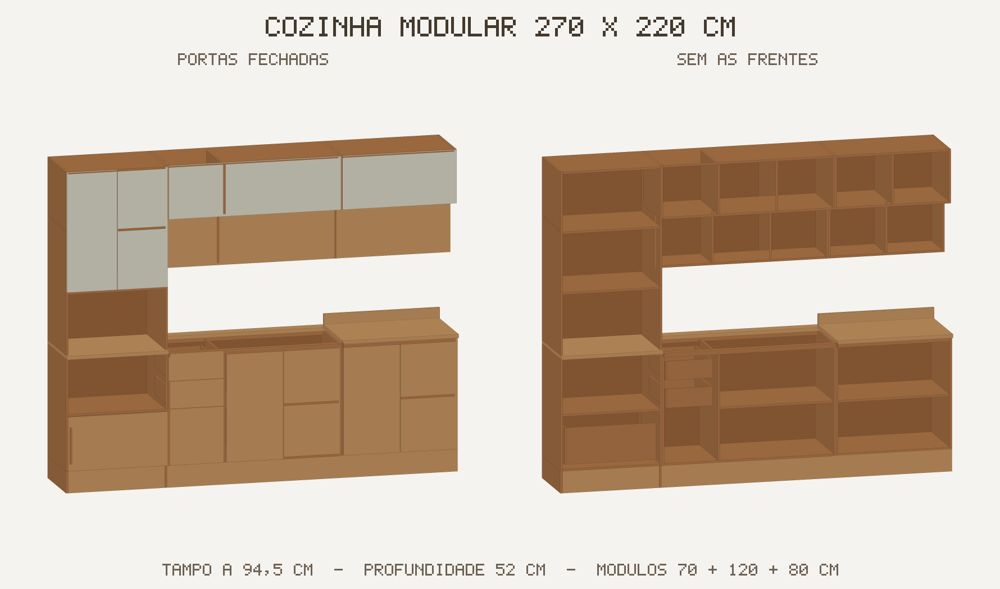

# Modelagem 3D da cozinha — pronta para o Homestyler

Modelo paramétrico de uma cozinha modular de **270 × 220 cm** (profundidade de tampo
52 cm), exportado nos formatos que o Homestyler aceita no upload de modelos próprios.



## O que enviar para o Homestyler

| Arquivo | Uso |
| --- | --- |
| `saida/cozinha_homestyler.glb` | **Mais simples** — arquivo único, já em metros, com os materiais embutidos |
| `saida/cozinha_homestyler.zip` | Alternativa em OBJ + MTL zipados (o importador pergunta a unidade) |
| `saida/cozinha_sem_portas.zip` / `.glb` | Mesmo móvel sem as frentes, para mostrar as divisões internas |
| `saida/previa.png` e `previa.svg` | Conferência visual antes do upload |
| `saida/pecas_modelo.json` | Lista dos 86 painéis (nome, posição, tamanho, material) |

### Passo a passo

1. No Homestyler, abra **Assets → My Models → Upload Model** (também chamado de *Model Upload*).
2. Envie `cozinha_homestyler.glb` (recomendado) ou `cozinha_homestyler.zip` (OBJ + MTL).
3. Se o importador perguntar a unidade do arquivo, escolha **centímetros** para o `.zip`
   (o OBJ é gerado em cm por padrão) e **metros** para o `.glb` — o formato glTF é
   sempre métrico.
4. Confira as dimensões na pré-visualização: **270 cm (largura) × 220 cm (altura) × 52 cm
   (profundidade)**. O modelo já vem com o eixo **Y para cima**, base em `Y = 0` e
   costas em `Z = 0`, então ele encosta na parede sem precisar de rotação.
5. Classifique como *Cabinet / Kitchen* e salve. O móvel passa a aparecer na sua
   biblioteca e pode ser arrastado para a planta.

> Dica: se preferir substituir os materiais pelos do catálogo do Homestyler, os quatro
> grupos já vêm separados (`madeira`, `frentes_madeira`, `off_white`, `fundo`), o que
> permite trocar acabamento por grupo em vez de peça por peça. As coordenadas de textura
> estão em metros reais, ou seja, uma textura repete a cada 1 m — bom ponto de partida
> para padronagens de madeira.

## Como o modelo é composto

* Rodapé de 15 cm ao longo dos 270 cm.
* Três módulos baixos: torre de 70 cm, balcão de 120 cm (2 gavetas + portas) e balcão
  de 80 cm; tampo de 25 mm a 94,5 cm do piso, com vão de bancada no módulo central.
* Torre alta de 125,5 cm acima do tampo, com duas prateleiras e duas portas.
* Aéreos de 74 cm de altura (faixa superior fechada de 46 cm e nichos inferiores de
  29 cm), com divisórias internas.
* Painéis de 15 mm; caixas de gaveta de 12 mm; folgas de 3–4 mm entre as frentes.

As medidas internas que não estavam cotadas nas referências foram estimadas. É um modelo
de representação para planta e render — não substitui projeto executivo de marcenaria.

## Regerar ou ajustar

O gerador usa **apenas a biblioteca padrão do Python 3.9+** (sem numpy, pycollada ou
ifcopenshell):

```bash
cd modelagem_3d
python3 gerar_homestyler.py            # OBJ em centímetros (padrão)
python3 gerar_homestyler.py --unidade m  # OBJ em metros, se o importador pedir
```

Para mudar o móvel, edite as chamadas de `box(...)` em `montar_pecas()`
(coordenadas em metros, `X` = largura, `Y` = profundidade com a parede em `Y = 0` e a
frente em `Y` negativo, `Z` = altura) e rode o script de novo.

Ao final, o script reabre os arquivos gerados e valida contagem de vértices e faces,
materiais usados e o *bounding box* de 270 × 220 × 52 cm — a execução falha se algo sair
fora dessas medidas.
